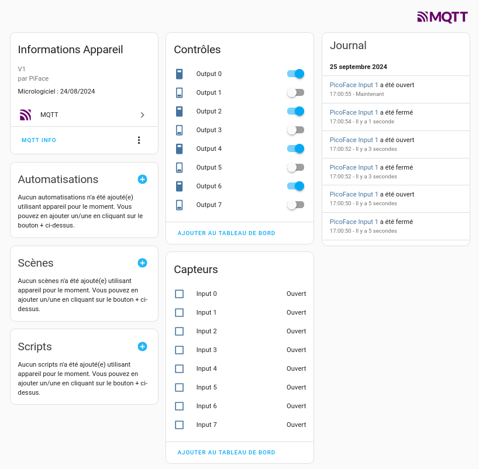

# Picoface
Pico Piface sous home-assistant

> Pilotage carte Piface V1 par MQTT sous Home-assistant ave cun Pico sous Micropython

La librairie MicroPython utlisée est reprise sur le [Github McHobby](https://github.com/mchobby/esp8266-upy/tree/master/hat-piface)


Le but de ce montage est de pouvoir piloter la Piface à partir de Home-assistant.
Pour cela j'ai utlisé le protocole [MQTT Discovery](https://www.home-assistant.io/integrations/mqtt/#mqtt-discovery) 
fourni par home-assistant pour créer automatiqument des appareils (devices) dans HA.

<br>

## Cablage avec une Pico Wifi

Le cablage avec la Pico-W utlise la SPI1 , la SPI0 est utlisé par le module Wifi embarqué.

Voici le cablage utilisée:

```
Pi Hat              Pico
5V          2       VBUS    40
3.3V        1       3.3V    36
Gnd         6       Gnd     2
GPIO10 MOSI 19      GP11    SPI1-TX 15
GPIO9  MISO 21      GP8     SP1-RX  11
GPIO11 SCLK 23      GP10    SPI SCK 14
GPIO8  CS0  24      GP9     SPI-CS  12
```

[](./images/Carte_Picoface_cablage.jpg)
   <br>

## Montage sur PCB


[](./images/Carte_Picoface_1.jpg)

<br>

## Code

Testé sur: **MicroPython v1.22.2 on 2024-02-22; Raspberry Pi Pico W with RP2040**

Au boot du Pico, les topics [MQTT Discovery](https://www.home-assistant.io/integrations/mqtt/#mqtt-discovery) HA sont envoyés 
et cela va créer un appareil **PicoFace** avec des entitées de type **binary_sensor** pour les *inputs* du Piface 
et des entités **switch** pour piloter les *outputs* du Piface.

Voici un exemple de topic à envoyer dans le protocole **MQTT Discovery** pour créer un input dans HA correspondant à l’*input0* de la Piface:

> homeassistant/binary_sensor/picoface/input0/config


```json
{
  "device": {
    "identifiers": [
      "picoface"
    ],
    "manufacturer": "PiFace",
    "name": "PicoFace",
    "model": "V1",
    "sw_version": "24/08/2024"
  },
  "name": "Input 0",
  "payload_on": "off",
  "state_topic": "home/pico/piface/input/0",
  "unique_id": "picoface_input_0",
  "force_update": true,
  "device_class": "opening",
  "expire_after": 600,
  "payload_off": "on"
}
```

Ce qui veux dire que le programme Micropython qui gère la Piface doit envoyer ce topic au démarrage 
et ensuite envoyer régulèrement l’état de *input0* sur le topic **home/pico/piface/input/0** à **on** ou **off** suivant l’état.


Pour les sorties du Piface voici le topic à envoyer au démarrage pour créer un **switch** pour la sortie *output0* dans HA:

> homeassistant/switch/picoface/output0/config

```json
{
  "retain": true,
  "device": {
    "identifiers": [
      "picoface"
    ],
    "manufacturer": "PiFace",
    "name": "PicoFace",
    "model": "V1",
    "sw_version": "24/08/2024"
  },
  "name": "Output 1",
  "payload_on": "on",
  "unique_id": "picoface_switch_output_0",
  "state_topic": "home/pico/piface/output/0",
  "state_on": "on",
  "state_off": "off",
  "command_topic": "home/pico/piface/switch/0",
  "payload_off": "off"
}
```

Le programme devra écouter les messages des topics de type **home/pico/piface/switch/** pour commander la sortie N en question 
et envoyer un topic **home/pico/piface/output/N** pour retourner l’état à HA ce qui permettra au **switch** dans HA de basculer (retour d'état).

Le code se compose de 2 fichiers:

- main.py (programme principal)
- config.py 
   * configution Wifi
   * configuration Brocker MQTT
   * Nom des topics
   * Paramètres du *device* créé dans home-assistant
   * Etat initial des *outputs*
   * Déclaration des *inputs* utlisés en compteur

j'ai rajouté une fonctionnalité qui permet de gérer des compteurs sur les inputs de la Piface, 
ceux-ci apparaitront comme **attribut** de l'entité *input* correspondante.

<br>

## Vue dans home-assistant

Dés la mise en route du Pico avec ce code, le *device* **PicoFace** doit apparaitre:

[](./images/ha_devices_picoface_1.png)

* Détail du *device*

[](./images/ha_devices_picoface_2.png)

* Vue de l'entité *input 1*

[](./images/ha_devices_picoface_3.png)

Avec son attribut **counter** comme préciser plus haut.

<br>

## Détail du fonctionnement

* Test commande output en shell

Faut utiliser le mode retain pour envoyer le msg **switch** sinon l'état de l'**output** perdu au reboot du Pico => '-r'

```
$ mosquitto_pub -h mqttbrocker -t "home/pico/piface/switch/0" -m on -r
```

* Mise à jour avec mpremote

```
$ mpremote a0 run mqttpiface-pico.py                # Excute le programme local sur le Pico (a0 = /dev/ttyACM0)
$ mpremote a0 fs cp mqttpiface-pico.py :main.py     # Copie programme local sur le Pico en main.py
$ mpremote a0 ls                                    # ls fichiers sur Pico
ls :
        1278 config.py
           0 lib/
       10417 main.py
$ mpremote a0                                       # Se connecte sur Pico en REPL
```

* Messages MQTT au boot du pico

> Topics MQTT Discovery envoyés

```
INFO 2025-04-07 19:49:11,867 0 0  homeassistant/switch/picoface/output0/config  {"retain": true, "device": {"identifiers": ["picoface"], "manufacturer": "PiFace", "name": "PicoFace", "model": "V1", "sw_version": "24/08/2024"}, "name": "Output 0", "payload_on": "on", "unique_id": "picoface_switch_output_0", "state_topic": "home/pico/piface/output/0", "state_on": "on", "state_off": "off", "command_topic": "home/pico/piface/switch/0", "payload_off": "off"}
INFO 2025-04-07 19:49:11,868 0 0  homeassistant/switch/picoface/output1/config  {"retain": true, "device": {"identifiers": ["picoface"], "manufacturer": "PiFace", "name": "PicoFace", "model": "V1", "sw_version": "24/08/2024"}, "name": "Output 1", "payload_on": "on", "unique_id": "picoface_switch_output_1", "state_topic": "home/pico/piface/output/1", "state_on": "on", "state_off": "off", "command_topic": "home/pico/piface/switch/1", "payload_off": "off"}
INFO 2025-04-07 19:49:11,868 0 0  homeassistant/switch/picoface/output2/config  {"retain": true, "device": {"identifiers": ["picoface"], "manufacturer": "PiFace", "name": "PicoFace", "model": "V1", "sw_version": "24/08/2024"}, "name": "Output 2", "payload_on": "on", "unique_id": "picoface_switch_output_2", "state_topic": "home/pico/piface/output/2", "state_on": "on", "state_off": "off", "command_topic": "home/pico/piface/switch/2", "payload_off": "off"}
INFO 2025-04-07 19:49:11,869 0 0  homeassistant/switch/picoface/output3/config  {"retain": true, "device": {"identifiers": ["picoface"], "manufacturer": "PiFace", "name": "PicoFace", "model": "V1", "sw_version": "24/08/2024"}, "name": "Output 3", "payload_on": "on", "unique_id": "picoface_switch_output_3", "state_topic": "home/pico/piface/output/3", "state_on": "on", "state_off": "off", "command_topic": "home/pico/piface/switch/3", "payload_off": "off"}
INFO 2025-04-07 19:49:11,869 0 0  homeassistant/switch/picoface/output4/config  {"retain": true, "device": {"identifiers": ["picoface"], "manufacturer": "PiFace", "name": "PicoFace", "model": "V1", "sw_version": "24/08/2024"}, "name": "Output 4", "payload_on": "on", "unique_id": "picoface_switch_output_4", "state_topic": "home/pico/piface/output/4", "state_on": "on", "state_off": "off", "command_topic": "home/pico/piface/switch/4", "payload_off": "off"}
INFO 2025-04-07 19:49:11,870 0 0  homeassistant/switch/picoface/output5/config  {"retain": true, "device": {"identifiers": ["picoface"], "manufacturer": "PiFace", "name": "PicoFace", "model": "V1", "sw_version": "24/08/2024"}, "name": "Output 5", "payload_on": "on", "unique_id": "picoface_switch_output_5", "state_topic": "home/pico/piface/output/5", "state_on": "on", "state_off": "off", "command_topic": "home/pico/piface/switch/5", "payload_off": "off"}
INFO 2025-04-07 19:49:11,871 0 0  homeassistant/switch/picoface/output6/config  {"retain": true, "device": {"identifiers": ["picoface"], "manufacturer": "PiFace", "name": "PicoFace", "model": "V1", "sw_version": "24/08/2024"}, "name": "Output 6", "payload_on": "on", "unique_id": "picoface_switch_output_6", "state_topic": "home/pico/piface/output/6", "state_on": "on", "state_off": "off", "command_topic": "home/pico/piface/switch/6", "payload_off": "off"}
INFO 2025-04-07 19:49:12,005 0 0  homeassistant/switch/picoface/output7/config  {"retain": true, "device": {"identifiers": ["picoface"], "manufacturer": "PiFace", "name": "PicoFace", "model": "V1", "sw_version": "24/08/2024"}, "name": "Output 7", "payload_on": "on", "unique_id": "picoface_switch_output_7", "state_topic": "home/pico/piface/output/7", "state_on": "on", "state_off": "off", "command_topic": "home/pico/piface/switch/7", "payload_off": "off"}
INFO 2025-04-07 19:49:12,005 0 0  homeassistant/binary_sensor/picoface/input0/config  {"json_attributes_topic": "home/pico/piface/inputattributs/0", "device": {"identifiers": ["picoface"], "manufacturer": "PiFace", "name": "PicoFace", "model": "V1", "sw_version": "24/08/2024"}, "name": "Input 0", "payload_on": "off", "state_topic": "home/pico/piface/input/0", "unique_id": "picoface_input_0", "force_update": true, "device_class": "opening", "expire_after": 600, "payload_off": "on"}
INFO 2025-04-07 19:49:12,006 0 0  homeassistant/binary_sensor/picoface/input1/config  {"json_attributes_topic": "home/pico/piface/inputattributs/1", "device": {"identifiers": ["picoface"], "manufacturer": "PiFace", "name": "PicoFace", "model": "V1", "sw_version": "24/08/2024"}, "name": "Input 1", "payload_on": "off", "state_topic": "home/pico/piface/input/1", "unique_id": "picoface_input_1", "force_update": true, "device_class": "opening", "expire_after": 600, "payload_off": "on"}
INFO 2025-04-07 19:49:12,006 0 0  homeassistant/binary_sensor/picoface/input2/config  {"json_attributes_topic": "home/pico/piface/inputattributs/2", "device": {"identifiers": ["picoface"], "manufacturer": "PiFace", "name": "PicoFace", "model": "V1", "sw_version": "24/08/2024"}, "name": "Input 2", "payload_on": "off", "state_topic": "home/pico/piface/input/2", "unique_id": "picoface_input_2", "force_update": true, "device_class": "opening", "expire_after": 600, "payload_off": "on"}
INFO 2025-04-07 19:49:12,007 0 0  homeassistant/binary_sensor/picoface/input3/config  {"json_attributes_topic": "home/pico/piface/inputattributs/3", "device": {"identifiers": ["picoface"], "manufacturer": "PiFace", "name": "PicoFace", "model": "V1", "sw_version": "24/08/2024"}, "name": "Input 3", "payload_on": "off", "state_topic": "home/pico/piface/input/3", "unique_id": "picoface_input_3", "force_update": true, "device_class": "opening", "expire_after": 600, "payload_off": "on"}
INFO 2025-04-07 19:49:12,007 0 0  homeassistant/binary_sensor/picoface/input4/config  {"json_attributes_topic": "home/pico/piface/inputattributs/4", "device": {"identifiers": ["picoface"], "manufacturer": "PiFace", "name": "PicoFace", "model": "V1", "sw_version": "24/08/2024"}, "name": "Input 4", "payload_on": "off", "state_topic": "home/pico/piface/input/4", "unique_id": "picoface_input_4", "force_update": true, "device_class": "opening", "expire_after": 600, "payload_off": "on"}
INFO 2025-04-07 19:49:12,008 0 0  homeassistant/binary_sensor/picoface/input5/config  {"json_attributes_topic": "home/pico/piface/inputattributs/5", "device": {"identifiers": ["picoface"], "manufacturer": "PiFace", "name": "PicoFace", "model": "V1", "sw_version": "24/08/2024"}, "name": "Input 5", "payload_on": "off", "state_topic": "home/pico/piface/input/5", "unique_id": "picoface_input_5", "force_update": true, "device_class": "opening", "expire_after": 600, "payload_off": "on"}
INFO 2025-04-07 19:49:12,073 0 0  homeassistant/binary_sensor/picoface/input6/config  {"json_attributes_topic": "home/pico/piface/inputattributs/6", "device": {"identifiers": ["picoface"], "manufacturer": "PiFace", "name": "PicoFace", "model": "V1", "sw_version": "24/08/2024"}, "name": "Input 6", "payload_on": "off", "state_topic": "home/pico/piface/input/6", "unique_id": "picoface_input_6", "force_update": true, "device_class": "opening", "expire_after": 600, "payload_off": "on"}
INFO 2025-04-07 19:49:12,073 0 0  homeassistant/binary_sensor/picoface/input7/config  {"json_attributes_topic": "home/pico/piface/inputattributs/7", "device": {"identifiers": ["picoface"], "manufacturer": "PiFace", "name": "PicoFace", "model": "V1", "sw_version": "24/08/2024"}, "name": "Input 7", "payload_on": "off", "state_topic": "home/pico/piface/input/7", "unique_id": "picoface_input_7", "force_update": true, "device_class": "opening", "expire_after": 600, "payload_off": "on"}
```

> Topics état des **inputs** ainsi que leur **attribut** au démarrage ainsi qu'un topic uptime

```
INFO 2025-04-07 19:49:12,075 0 0  home/pico/piface/sys/uptime  1609530277
INFO 2025-04-07 19:49:12,075 0 0  home/pico/piface/input/0  off
INFO 2025-04-07 19:49:12,076 0 0  home/pico/piface/inputattributs/0  {"counter": 0}
INFO 2025-04-07 19:49:12,076 0 0  home/pico/piface/input/1  off
INFO 2025-04-07 19:49:12,077 0 0  home/pico/piface/inputattributs/1  {"counter": 0}
INFO 2025-04-07 19:49:12,077 0 0  home/pico/piface/input/2  off
INFO 2025-04-07 19:49:12,077 0 0  home/pico/piface/inputattributs/2  {"counter": 0}
INFO 2025-04-07 19:49:12,079 0 0  home/pico/piface/input/3  off
INFO 2025-04-07 19:49:12,080 0 0  home/pico/piface/inputattributs/3  {"counter": 0}
INFO 2025-04-07 19:49:12,082 0 0  home/pico/piface/input/4  off
INFO 2025-04-07 19:49:12,083 0 0  home/pico/piface/inputattributs/4  {"counter": 0}
INFO 2025-04-07 19:49:12,085 0 0  home/pico/piface/input/5  off
INFO 2025-04-07 19:49:12,086 0 0  home/pico/piface/inputattributs/5  {"counter": 0}
INFO 2025-04-07 19:49:12,087 0 0  home/pico/piface/input/6  off
INFO 2025-04-07 19:49:12,088 0 0  home/pico/piface/inputattributs/6  {"counter": 0}
INFO 2025-04-07 19:49:12,089 0 0  home/pico/piface/input/7  off
INFO 2025-04-07 19:49:12,091 0 0  home/pico/piface/inputattributs/7  {"counter": 0}
```

> Topics **output** reçu du Brocker suite au mode retain 

```
INFO 2025-04-07 19:49:12,092 0 0  home/pico/piface/output/0  on
INFO 2025-04-07 19:49:12,093 0 0  home/pico/piface/output/1  off
INFO 2025-04-07 19:49:12,094 0 0  home/pico/piface/output/2  off
INFO 2025-04-07 19:49:12,095 0 0  home/pico/piface/output/3  off
INFO 2025-04-07 19:49:12,096 0 0  home/pico/piface/output/4  off
INFO 2025-04-07 19:49:12,097 0 0  home/pico/piface/output/5  off
INFO 2025-04-07 19:49:12,098 0 0  home/pico/piface/output/6  off
INFO 2025-04-07 19:49:12,209 0 0  home/pico/piface/output/7  off
INFO 2025-04-07 19:49:12,212 0 0  home/pico/piface/output/2  off
INFO 2025-04-07 19:49:12,212 0 0  home/pico/piface/output/1  off
INFO 2025-04-07 19:49:12,213 0 0  home/pico/piface/output/4  on
```

> Ensuite toutes 60s, l'état des **inputs** et **outputs** est envoyé

```
INFO 2025-04-07 22:56:43,911 0 0  home/pico/piface/sys/uptime  1609468115
INFO 2025-04-07 22:56:43,911 0 0  home/pico/piface/input/0  off
INFO 2025-04-07 22:56:43,911 0 0  home/pico/piface/inputattributs/0  {"counter": 0}
INFO 2025-04-07 22:56:43,912 0 0  home/pico/piface/input/1  off
INFO 2025-04-07 22:56:43,938 0 0  home/pico/piface/inputattributs/1  {"counter": 0}
INFO 2025-04-07 22:56:43,939 0 0  home/pico/piface/input/2  off
INFO 2025-04-07 22:56:43,939 0 0  home/pico/piface/inputattributs/2  {"counter": 0}
INFO 2025-04-07 22:56:43,940 0 0  home/pico/piface/input/3  off
INFO 2025-04-07 22:56:43,940 0 0  home/pico/piface/inputattributs/3  {"counter": 1}
INFO 2025-04-07 22:56:43,940 0 0  home/pico/piface/input/4  off
INFO 2025-04-07 22:56:43,941 0 0  home/pico/piface/inputattributs/4  {"counter": 0}
INFO 2025-04-07 22:56:43,941 0 0  home/pico/piface/input/5  off
INFO 2025-04-07 22:56:43,942 0 0  home/pico/piface/inputattributs/5  {"counter": 0}
INFO 2025-04-07 22:56:43,943 0 0  home/pico/piface/input/6  off
INFO 2025-04-07 22:56:43,944 0 0  home/pico/piface/inputattributs/6  {"counter": 0}
INFO 2025-04-07 22:56:43,945 0 0  home/pico/piface/input/7  off
INFO 2025-04-07 22:56:43,946 0 0  home/pico/piface/inputattributs/7  {"counter": 0}
INFO 2025-04-07 22:56:43,947 0 0  home/pico/piface/output/0  off
INFO 2025-04-07 22:56:43,948 0 0  home/pico/piface/output/1  off
INFO 2025-04-07 22:56:43,949 0 0  home/pico/piface/output/2  off
INFO 2025-04-07 22:56:43,950 0 0  home/pico/piface/output/3  off
INFO 2025-04-07 22:56:43,951 0 0  home/pico/piface/output/4  on
INFO 2025-04-07 22:56:43,952 0 0  home/pico/piface/output/5  off
INFO 2025-04-07 22:56:43,953 0 0  home/pico/piface/output/6  off
INFO 2025-04-07 22:56:43,954 0 0  home/pico/piface/output/7  off
```


